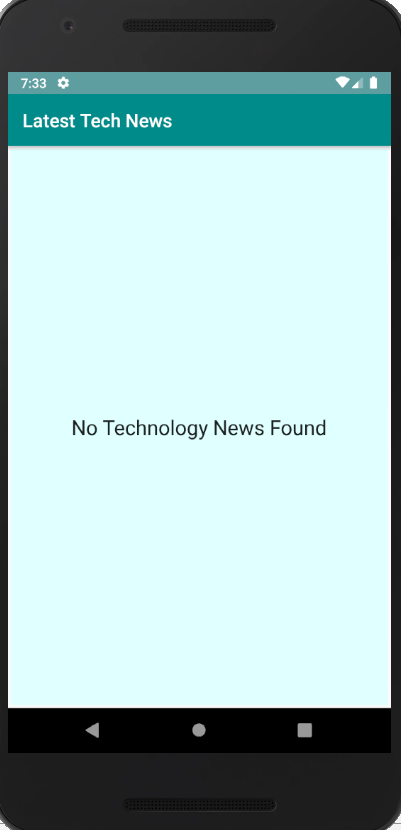
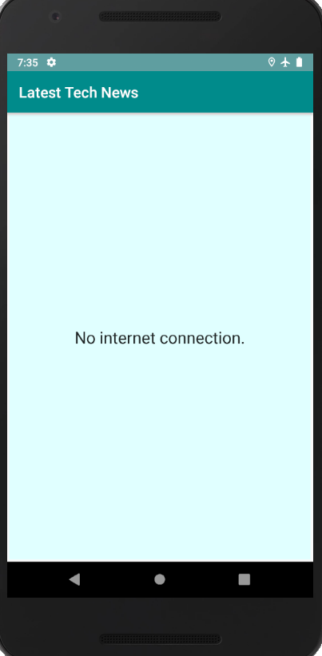

# TechNews

The goal of this application was to prase responses from an API, update the information into the app, and properly display that information.
This was actually my last project for Android Basics NanoDegree at Udacity.

  

The App requires an API KEY which can be obtained from the [Guardian Platform](https://open-platform.theguardian.com/documentation).
Add your API KEY on TechActivity.class as follows: api-key=YOUR_API_KEY.

  

